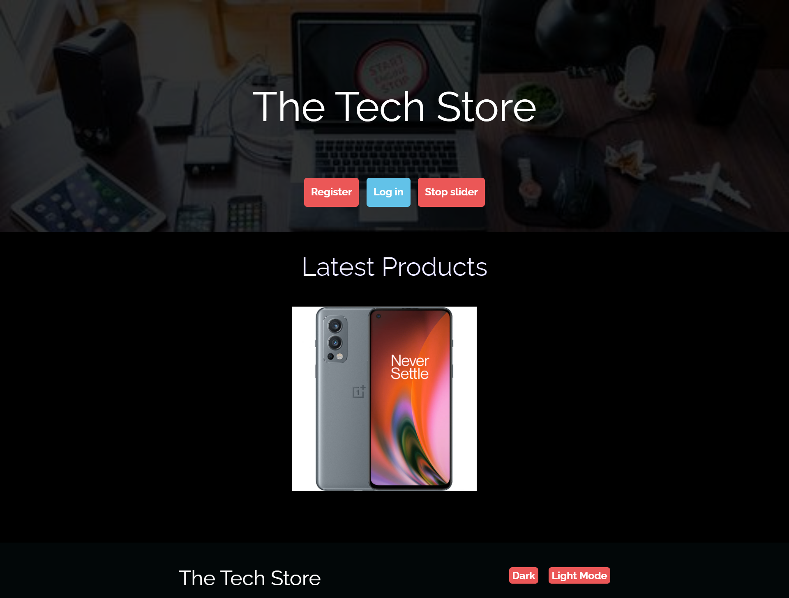
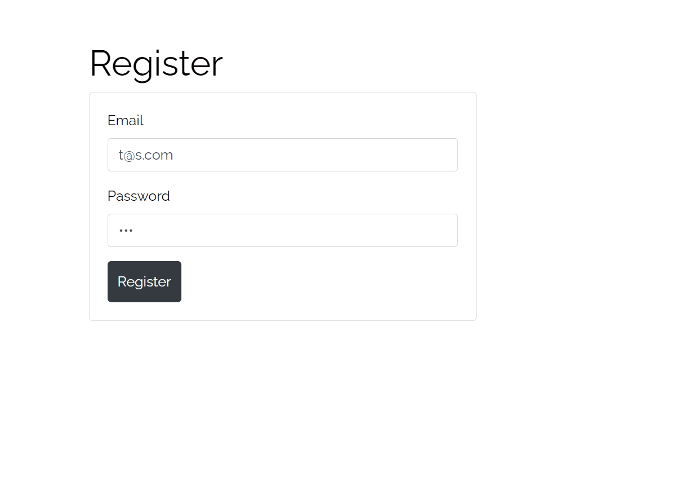
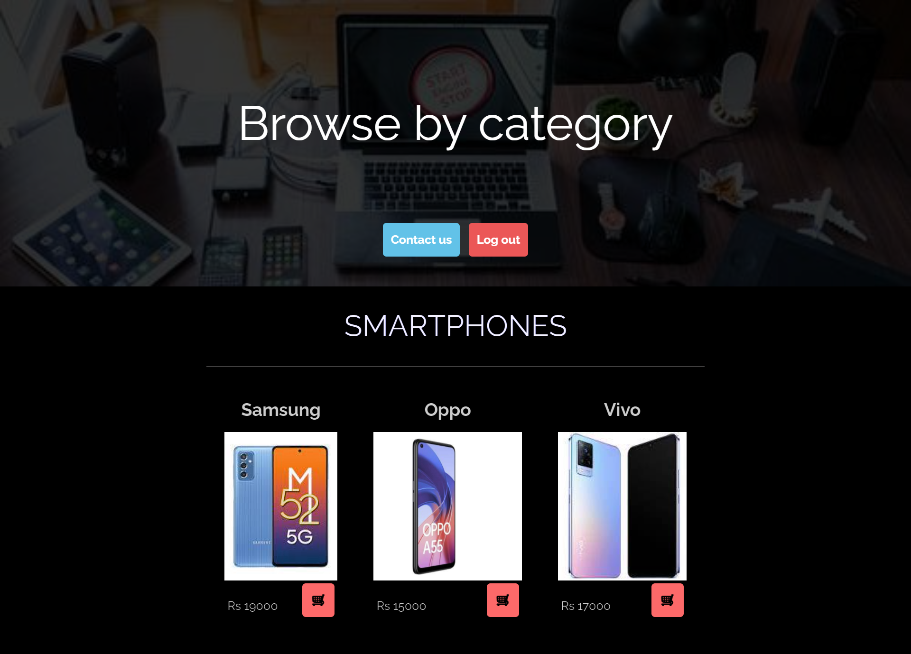
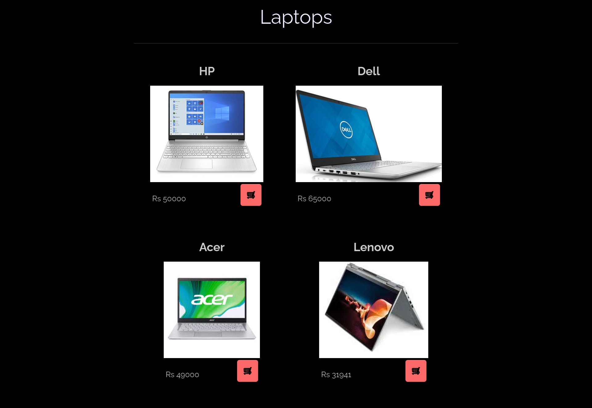
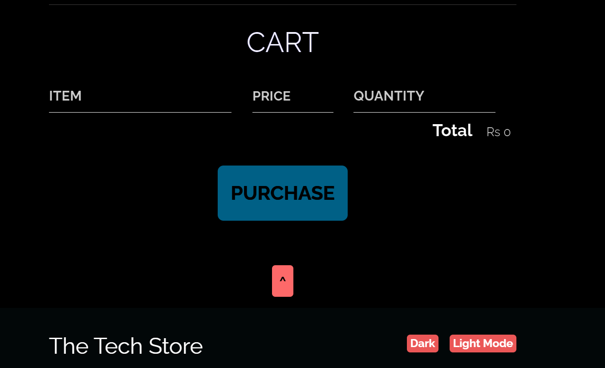
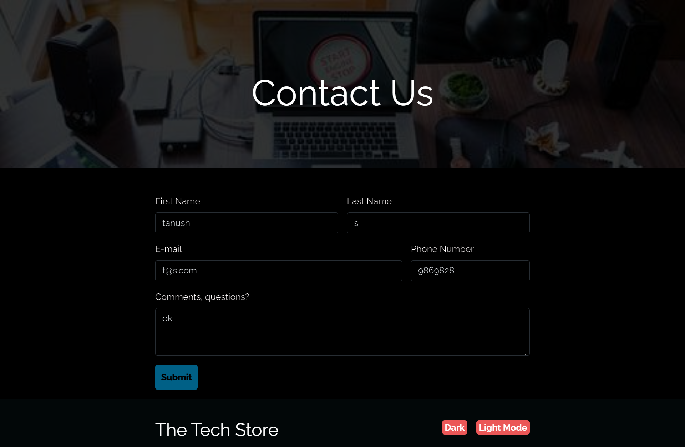
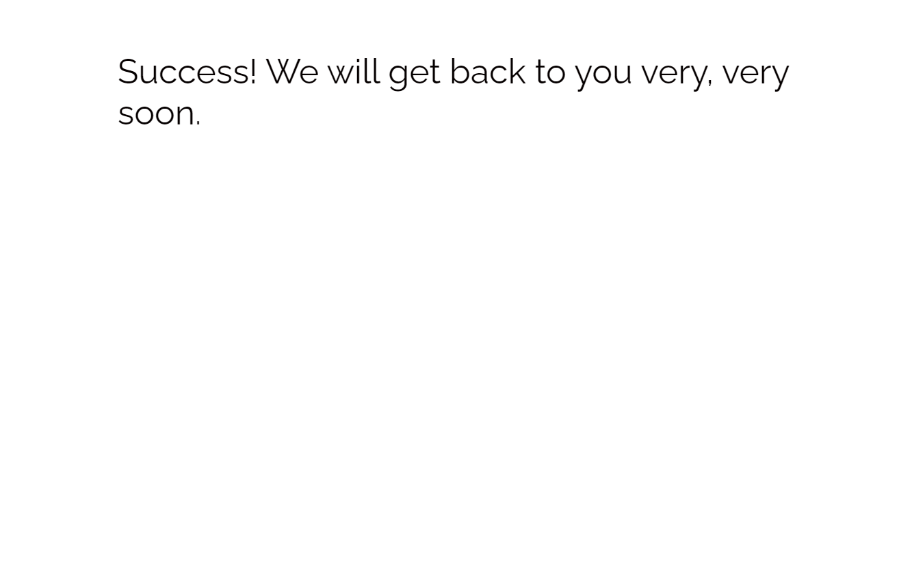

<h1>Tech_Store</h1>

Overview : 

A web application to check latest tech products available online. Users can register/sign up, browse through products by category. Users can add products they want to purchase to shopping cart or contact site admin for any queries by providing relevant details. The database being used is MongoDB. Thus the website serves as a simple guide for customers as to what products are trending in market.

Working:

Although the user can access home page without creating an account, but for viewing all new products available having a user account is required.                                                             

 

<ol type = "1">
  <li>Login: </li>
<ol type = "i">     
<li>Old customers, who have an account can use the website by simply entering their email ID and password in the login section.</li>
<li>The entered pair of email ID and password is matched with the existing records in the database. If match is found then the user can proceed further.</li>
<li>In case of failure, then the user need to enter the credentials again.</li>
  </ol>

  <li>Register:  </li>
<ol type = "i">                                                                         
<li>New users, who don’t have an account can start by clicking the register option on the home page</li>
<li>Here, the user needs to create new account by entering their email ID and password</li>
<li>Submitting the above mentioned details will create a new user account.</li>
  </ol>

  <li>Store page: </li>
On registering user can access store page where they can browse available products, add to shopping cart any product, increase number of items, remove chosen product.
The total cost will be updated.

  <li>Contact Page </li>
Users can also contact site admin if they face any issue while browsing the website. On submitting successfully, a success page will be shown.

  
  <li>The site also has dark mode on by default which can be turned off by button at bottom. </li>
</ol>

Programming languages used:
<ul>
<li>HTML</li>
<li>CSS</li>
<li>JavaScript</li>
<li>SQL</li>
</ul>
Libraries used:
<ul>
<li>Bootstrap</li>
  </ul>
